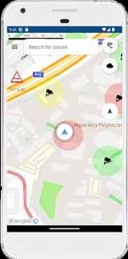
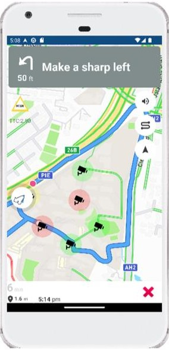
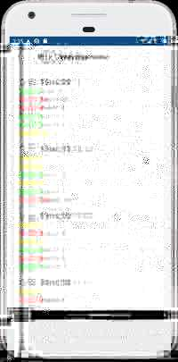
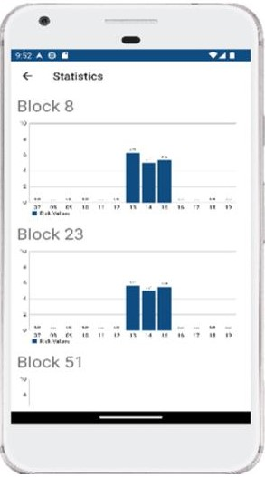

# RERAC – Intelligent Transport Risk Monitoring Prototype

RERAC is an academic intelligent-transport prototype built to visualise road-risk information around **Ngee Ann Polytechnic, Singapore**. The final application combines a native **Kotlin/Android** client with **Mapbox navigation**, a **Node.js/Express** REST API and **MySQL** risk data.

The project demonstrates the full path from generated transport-risk data to a location-aware mobile interface: data generation, persistence, API delivery, mapping, navigation, proximity warnings and historical visualisation.

> **Archived academic project:** completed previously and uploaded retrospectively for portfolio use. The source has since received cleanup changes; this copy has not been freshly compiled or tested end-to-end. Screenshots show the original project.

## Screenshots

These screenshots were extracted from the original project report and show the final Android/Mapbox prototype. The portfolio code has since been cleaned for public release, so small visual details may differ from a fresh local build.

| Map and risk visualisation | Turn-by-turn navigation |
| --- | --- |
|  |  |
| **Recent risk overview** | **Historical risk statistics** |
|  |  |

The report documents the Android version's Mapbox home screen, turn-by-turn navigation, recent risk overview and location-based statistics as part of the final prototype.

## Architecture

```text
Python mock-data generator
        ↓
      MySQL
        ↓
Node.js / Express REST API
        ↓
Android / Kotlin application
        ↓
Mapbox navigation + risk visualisation
```

The original project used mock data because the underlying project dataset was non-public. The original Python generator was no longer available when this portfolio copy was prepared, so `data-generator/` contains a clearly labelled **reconstructed demo generator** based on the database fields and pipeline used by the application.

## Why the project moved from Flutter to native Android

RERAC was initially prototyped with Flutter and Google Maps. During development, the navigation workflow available to that prototype did not meet the turn-by-turn requirements of the project, so the final implementation moved to native Android with Kotlin and Mapbox.

That migration allowed the final prototype to combine routing, navigation-camera behaviour, map annotations, live risk information and proximity alerts in one application.

## Features

- Interactive Mapbox map and place autocomplete
- Turn-by-turn routing using the device's real location
- Dynamic risk markers for monitored campus locations
- Risk-radius visualisation using metre-accurate geographic circles
- Geofence-style proximity alerts at 50 m and 25 m thresholds
- Text-to-speech warnings without repeating the same alert every polling cycle
- Risk/TTC data refreshed from the Node.js API
- Recent risk overview
- Historical average-risk charts by location
- Current Singapore weather information
- Configurable API keys and backend URL with secrets excluded from Git
- Clearly labelled prototype-only screens for ideas that were explored but not completed

## Demo flow

The original prototype demonstrated the following flow. This is a description of the project, rather than a freshly verified test of the cleaned archive:

1. Launch the Android app and grant location access.
2. View monitored locations and their current risk-radius colours on the map.
3. Search for a destination or select a point on the map and start turn-by-turn navigation.
4. Approach a monitored location to trigger the visual risk/TTC indicator and text-to-speech proximity warning.
5. Open **Risk Overview** to inspect the latest backend snapshots.
6. Open **Statistics** to compare historical average-risk values across monitored locations.

## Repository structure

```text
android-app/       Final Kotlin / Mapbox Android application
backend/           Node.js / Express REST API
database/          Reconstructed MySQL schema for the demo environment
data-generator/    Reconstructed Python mock-data generator
docs/images/       Screenshots extracted from the original project report
.github/workflows/ Lightweight source checks
```

## Optional local setup

These instructions document the demo configuration for anyone who wants to attempt a local run. Running the project is not required to browse this archive; historical SDK compatibility and dependency access may need additional work.

### 1. Create the MySQL database

Create a database named `testing` (or choose another name through `DB_NAME`) and run:

```bash
mysql -u root -p testing < database/schema.sql
```

### 2. Generate demo data

From `data-generator/`:

```bash
python -m pip install -r requirements.txt
python generate_mock_data.py --rows 12 --days 1
```

The generator reads `DB_HOST`, `DB_USER`, `DB_PASSWORD` and `DB_NAME` from the environment.

### 3. Run the Node.js backend

From `backend/`:

```bash
npm install
npm run check
npm start
```

`GET /health` can be used to verify that the API can reach MySQL.

### 4. Configure the Android application

Copy:

```text
android-app/local.properties.example
```

to:

```text
android-app/local.properties
```

Fill in your local Android SDK path, Mapbox credentials, OpenWeather API key and backend URL.

For an Android emulator, a backend running on the host computer can normally be reached at:

```text
http://10.0.2.2:3000
```

For a physical Android device, use an address that is reachable from that device, such as the development computer's LAN IP while both devices are on the same network.

## Backend API

- `GET /health`
- `GET /risks`
- `GET /last5risks`
- `GET /risk8`
- `GET /risk23`
- `GET /risk51`
- `GET /risk72`
- `GET /risk73`
- `GET /riskSIT`

## Security and privacy

The public-facing source is intentionally separated from local secrets. API tokens, MySQL passwords, `.env`, Android `local.properties`, Gradle build outputs and `node_modules` must not be committed. Configuration examples contain placeholders only. Run `python scripts/check_secrets.py` before committing, or add `--history` to include reachable Git history. This check reports file locations without printing matched values.

The repository contains **generated/demo data only**. It does not include the original non-public dataset or local credentials. The screenshots are from the project's own report and are included only to demonstrate the prototype UI.

The portfolio cleanup fixes activity exposure, replaces Mapbox replay simulation with real device location, makes background work lifecycle-aware, validates network responses, keeps UI updates on the main thread, corrects metre-based risk-radius calculations, prevents repeated proximity announcements, and consolidates duplicated chart/network code. Incomplete Saved Locations and Report-an-Issue ideas are retained only as clearly labelled prototype screens rather than being presented as finished features.

## Technology

**Android:** Kotlin, Android SDK, Mapbox Maps/Navigation/Search, OkHttp, MPAndroidChart, Android TextToSpeech  
**Backend:** Node.js, Express, MySQL2  
**Data:** MySQL, Python mock-data generation  
**External service:** OpenWeather

## Prototype limitations and future work

- The portfolio repository uses generated data rather than the original non-public project dataset.
- The prototype is geographically focused on the monitored campus locations used during the project.
- The Mapbox/Android dependencies intentionally remain close to the original implementation rather than being blindly upgraded to a newer major SDK.
- Saved Locations and Report-an-Issue remain prototype concepts rather than completed production features.
- Missing risk fields currently fall back to zero, failed requests can leave older readings visible, and missing chart hours appear as zero; these are prototype limitations, not verified safety measurements.
- Proximity checks depend on successful backend polling and do not implement an offline alert system.
- The traffic button currently changes its visual selection state without switching the map traffic display.
- A production deployment would use an HTTPS-hosted backend, stronger API authentication, persistent user preferences and broader automated Android testing.

## Verification status

- Node.js backend syntax is checked with `npm run check` and GitHub Actions.
- The reconstructed Python generator has been syntax-checked.
- The Android source has been cleaned for the major lifecycle, threading, location and configuration issues found during review.
- A fresh Android build is **not claimed as CI-verified** in this portfolio copy because the historical Mapbox dependency setup requires local Mapbox credentials and SDK access. The original project had previously been built and run; a future SDK migration should be tested separately rather than mixed into this archival cleanup.

## Project status

This repository is a cleaned portfolio archive of an academic prototype. Local build reproducibility has not been reverified. It preserves the original architecture and major implementation choices while fixing issues that would make the source unsafe or misleading to publish. The Mapbox/Android dependencies intentionally remain close to the original project versions rather than being blindly upgraded.
